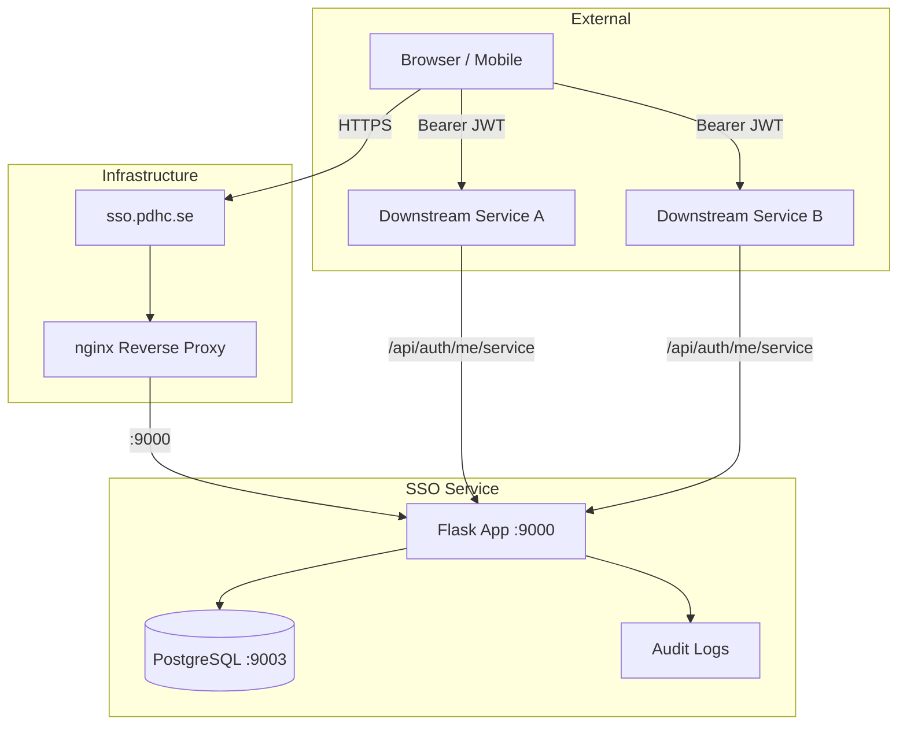
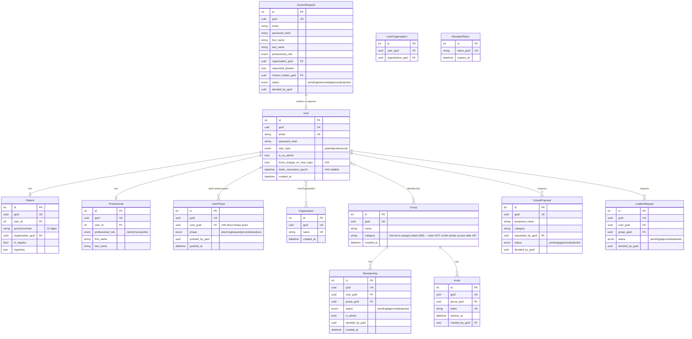
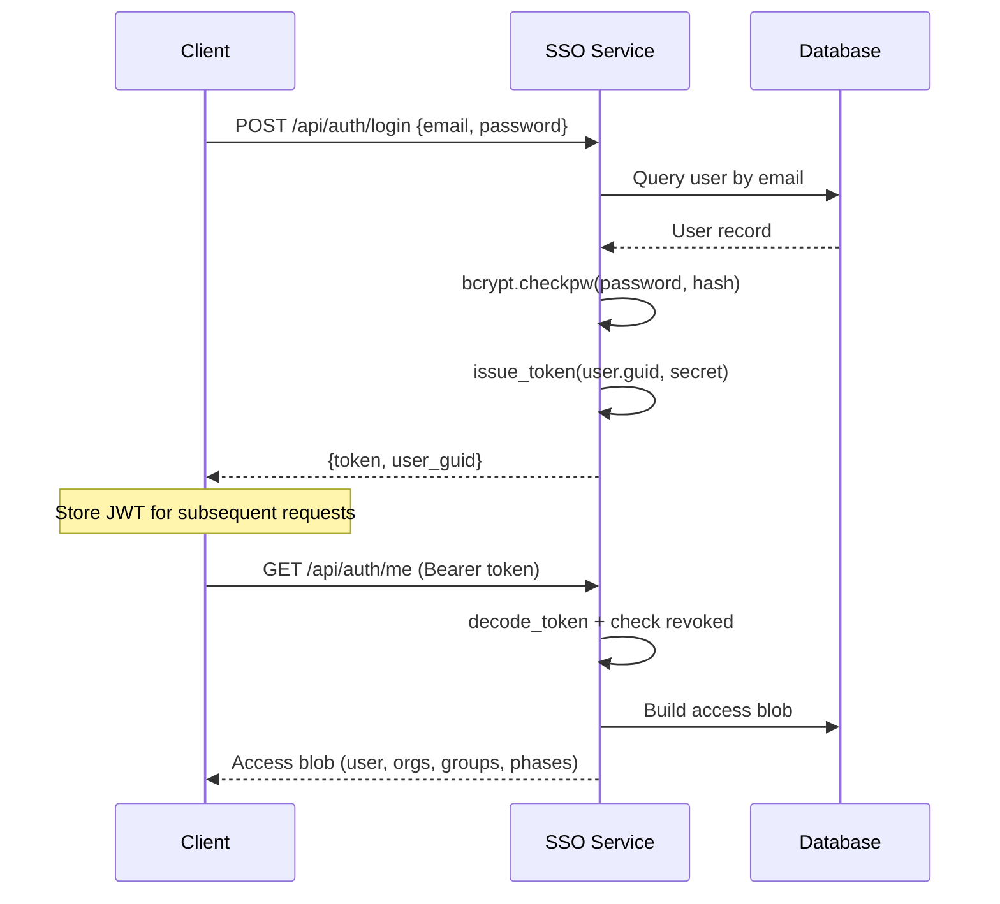
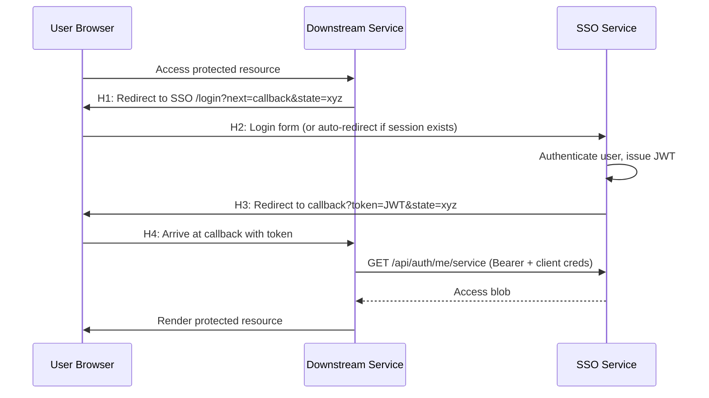
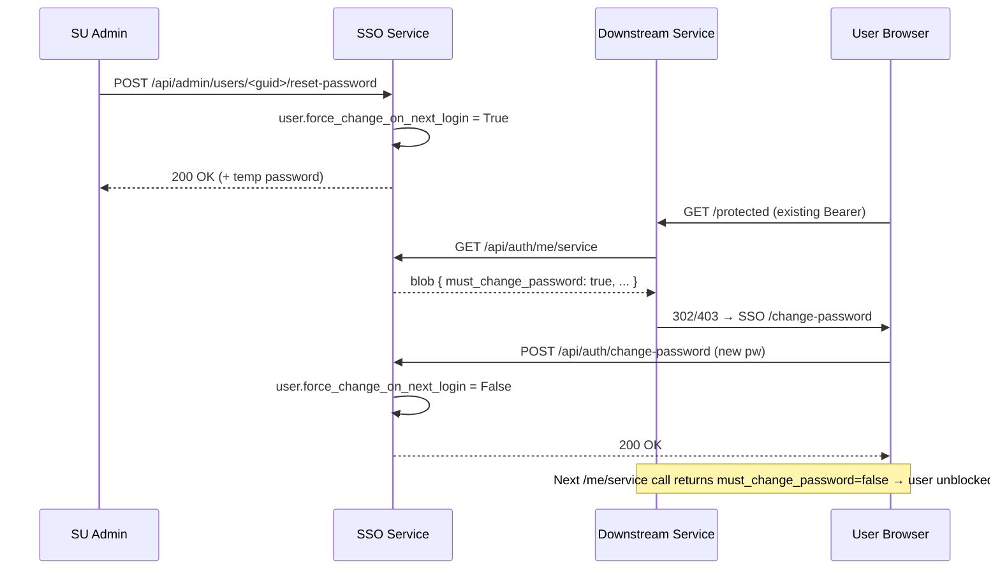
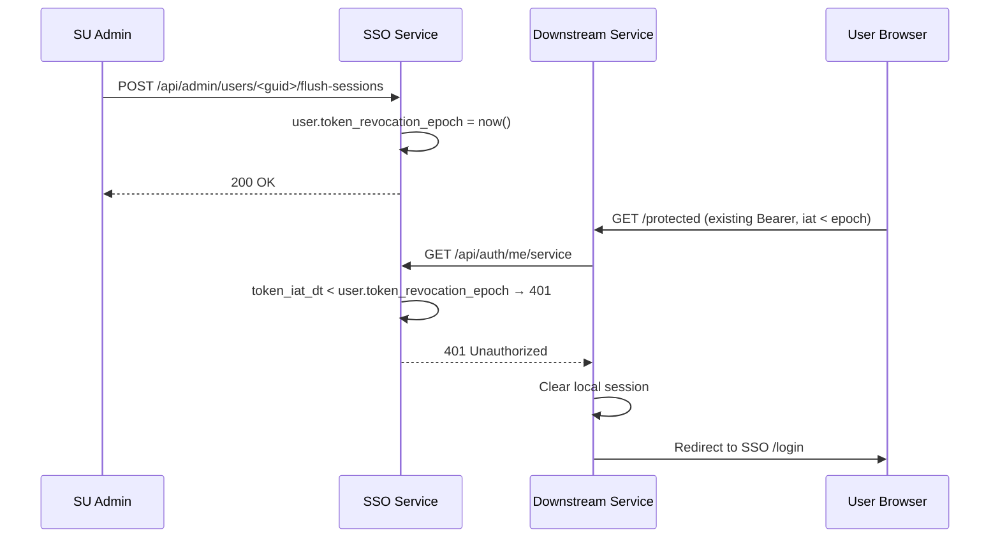
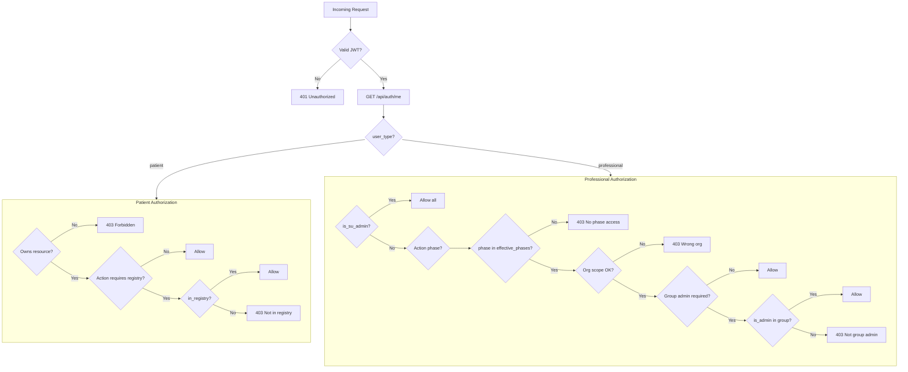

# Architecture Overview

## System Context



## Data Model

All tables use integer primary keys internally and UUID4 GUIDs for external references (Rule 18).



### FHIR Resource Mapping

| Table | FHIR Resource Type |
|-------|-------------------|
| Patient | Patient |
| Professional | Practitioner |
| Organisation | Organization |
| Group | Group |

## Authentication Flow

### Standard Login



### SSO Handshake (H1–H4)

Used by downstream services to authenticate users through the central SSO.



**Security controls:**

- `next` URL validated against `ALLOWED_CALLBACK_URLS` allowlist
- `state` parameter passed through for CSRF protection
- Auto-redirect skips login form if user has valid session
- Service-to-service calls require `X-SSO-Client-Id` and `X-SSO-Client-Secret` headers

### Forced Password Reset (#43)



### Bulk Session Flush (#44)



Cheaper than inserting N revoked-token rows when the set of active `jti`s is unknown (e.g. after a credential compromise across multiple devices).

## Access Blob Schema

The access blob is the core data structure returned by `/api/auth/me`. Downstream services use it to make authorization decisions.

### Patient Access Blob

```json
{
  "user_guid": "a1b2c3d4-...",
  "email": "patient@example.com",
  "user_type": "patient",
  "is_su_admin": false,
  "must_change_password": false,
  "patient_guid": "e5f6g7h8-...",
  "organisation_guid": "i9j0k1l2-...",
  "in_registry": true,
  "registries": ["INCA"],
  "fhir_resource_type": "Patient"
}
```

### Professional Access Blob

```json
{
  "user_guid": "m3n4o5p6-...",
  "email": "doctor@hospital.se",
  "user_type": "professional",
  "is_su_admin": false,
  "must_change_password": false,
  "professional_guid": "q7r8s9t0-...",
  "professional_role": "doctor",
  "fhir_resource_type": "Practitioner",
  "organization_ids": ["i9j0k1l2-..."],
  "groups": [
    {
      "group_guid": "u1v2w3x4-...",
      "group_name": "Oncology Planning",
      "category": "planning",
      "status": "approved",
      "is_admin": false
    }
  ],
  "effective_phases": ["planning", "analysis"]
}
```

`effective_phases` is sourced **exclusively** from direct `UserPhase` grants (#46 + #57), populated by SU via `POST /api/admin/users/<guid>/phases`.

**Groups and phases are orthogonal access criteria (#57).** `Group.category` (renamed from `group_type` in #60) is a free-form organisational label — approved membership in a group with `category = "planning"` does **not** confer the `planning` phase. Each downstream service composes its own access policy from independent inputs (membership, phase, org scope); the SSO merely supplies the raw facts.

Downstream services should continue to check `phase in blob["effective_phases"]` — the field name and shape are unchanged; only the source of truth narrowed.

## Decision Tree

Downstream services use the access blob to authorize actions:



## Middleware Stack

Each request passes through these layers in order:

1. **CORS** — validates `Origin` header against `ALLOWED_ORIGINS`
2. **Rate Limiter** — in-memory per-IP limits (configurable per endpoint)
3. **CSRF** — Flask-WTF token validation on form POST (API routes exempt)
4. **Auth Middleware** — JWT decode, `jti` revocation check, `iat < user.token_revocation_epoch` check (#44), user loading into `g.current_user`
5. **Route Handler** — blueprint endpoint logic
6. **Audit Logger** — structured log entry for sensitive operations

## Port Allocation

| Port | Service |
|------|---------|
| 9000 | Flask application (Gunicorn) |
| 9003 | PostgreSQL database |
