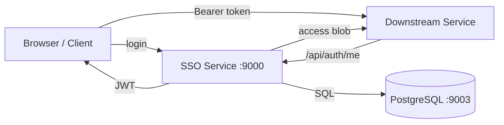

# formserviceFHIR SSO Documentation

Welcome to the documentation for **formserviceFHIR** — the central SSO/OAuth service for PDHC.

## What is formserviceFHIR?

formserviceFHIR is a Flask-based SSO server that:

- Issues **JWT tokens** for authenticated users (patients and professionals)
- Manages **users, groups, memberships, and organisations**
- Delivers an **access blob** to downstream FHIR-compliant microservices
- Enforces **FHIR R5 compliance** across API responses, data models, and validation
- Serves as the **single source of truth** for organisations across the PDHC ecosystem

## Key Features

| Feature | Description |
|---------|-------------|
| **JWT Authentication** | HS256 tokens with configurable expiry and revocation |
| **SSO Handshake** | `next`/`state` redirect flow for downstream services |
| **FHIR R5** | CapabilityStatement, validated resource shapes, `fhir.resources` integration |
| **Role-Based Access** | Patient, Professional, Group Admin, SU Admin |
| **Group Management** | Membership requests, approvals, invites, leader elections |
| **Audit Logging** | Structured file-based logs for all sensitive operations |
| **Service Registry** | `oath_overview.csv` tracks all connected microservices |

## Architecture at a Glance

## Quick Links

- [Architecture Overview](architecture.md) — data model, auth flow, SSO handshake
- [API Reference](api-reference.md) — all endpoints with request/response examples
- [Integration Guide](integration-guide.md) — connect your service to SSO
- [Admin Manual](admin-manual.md) — SU and group admin operations
- [Deployment Guide](deployment-guide.md) — local dev and server setup
- [User Guide](user-guide.md) — professional and patient workflows

## FHIR Compliance

The service exposes a CapabilityStatement at `GET /fhir/metadata` describing supported resources:

- **Patient** — read, create (via registration)
- **Practitioner** — read, create (via access request approval)
- **Organization** — read, create, search
- **Group** — read, create, search

All API responses use FHIR-shaped payloads where applicable. Inbound/outbound validation uses the `fhir.resources` library (FHIR R5, v8.x).

## Technology Stack

| Component | Technology |
|-----------|-----------|
| Backend | Flask (Python 3.11+) |
| Database | PostgreSQL (prod) / SQLite (tests) |
| ORM | SQLAlchemy |
| Auth | JWT (PyJWT, HS256) + bcrypt |
| FHIR | fhir.resources v8 (R5) |
| Frontend | Jinja2 templates (PDHC Layout Standard) |
| Docs | MkDocs with Material theme |
| Container | Docker + docker-compose |
